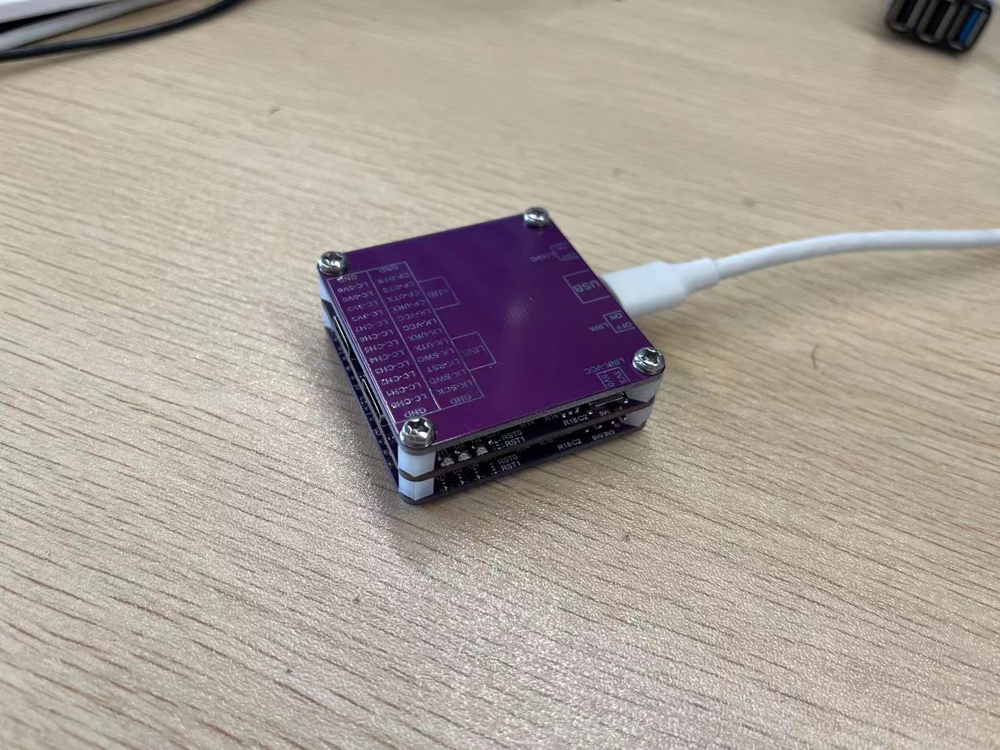
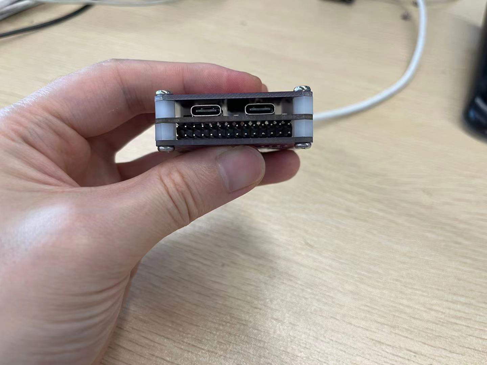
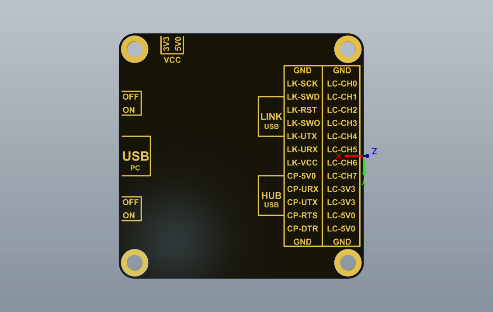
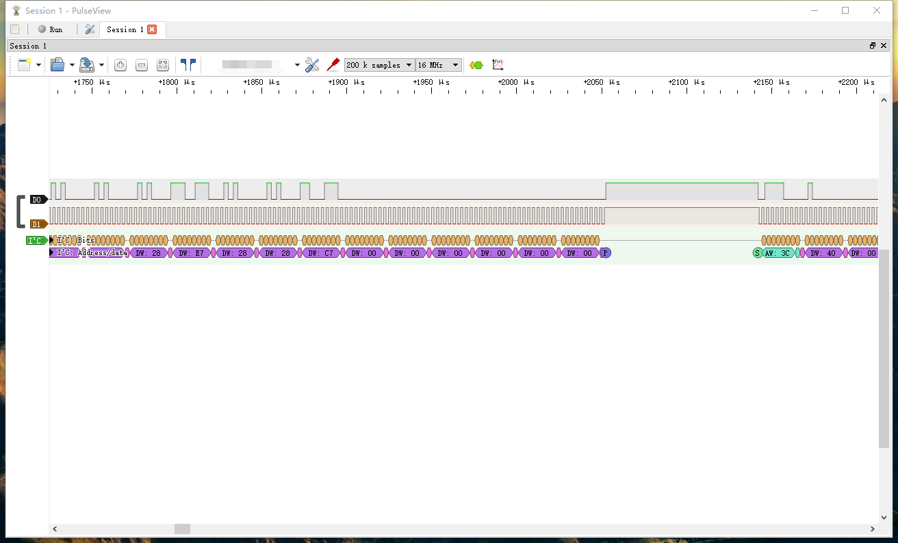

# link_logic
带link调试功能、串口调试、逻辑分析仪与一身的数字调试器 

亲测功能

## 简介
本项目是一个link logic，用于调试带SWD接口的单片机、以及带有逻辑分析仪。是一个美观、小巧、功能全的逻辑分析仪调试器。

## 实物展示

## 优点
- 小巧、多功能
- 插针隐藏设计、方便携带
- 支持Link调试器
- 支持逻辑分析仪
- 支持ESP32等IC的自动下载（RTS、DTR信号预留）
- 使用Typec接口的自定义成SWD、UART信号接口

## 功能
1. link调试器
2. USB转UART（CP2102虚拟的串口）
3. USB HUB（可以再接入其他1个USB设备，TYPEC接口）
4. 支持逻辑分析仪功能

## 接口说明

丝印说明：LC表示逻辑分析仪功能模块、LK表示Link功能模块、CP表示CP2102串口

1. LINK调试器、逻辑分析仪、CP2102串口三大功能，LINK调试器、逻辑分析仪可分别开关操作，防止USB接口电流过大影响功能。
2. Link调试器输出电压端可切换3.3V和5.0V，适配供电给不同的单片机
3. LC-CH0至LC-CH7为逻辑分析仪的采集端（LINK打开时可用），LC-3V3、LC-5V0同时受LINK开关控制，只有打开时才有电压。
4. LK-SCK、LK-SWD、LK-RST、LK-SWO是Link调试器的接口，一般情况只使用LK-SCK、LK-SWD即可
5. LK-URX、LK-UTX是Link调试器的串口TTL接口（不同Link的固件可能不支持）
6. LK-VCC，是Link调试器的电压输出，电压值由LINK-VCC切换开关控制
7. CP-URX、CP-UTX、CP-RTS、CP-DTR是CP2102串口的接口，CP-RTS、CP-DTR可用于类似ESP32的串口自动下载。可参考ESP32官方电路设计。
8. 所有GND共地
9. LINK的typec USB接口有两种连接方式分别表示正插是LINK调试器、反插是串口功能
	- 正：DP与SCK连接、DN与SWD连接
	- 反：DP与UTX连接、DN与URX连接
10. HUB 的typec USB接口可以接USB设备到PC。也可以使用两个link_logic级联，不建议多级连接，USB性能会下降。

注意：建议将link_logic直接接在PC的USB口上，不接在其他USB HUB上，因为本设备中已经含有一个USB HUB，多级HUB连接，影响逻辑分析仪的采集性能，逻辑分析仪需要用到USB2.0的高速模式。

## 演示

## 固件烧录

1. 逻辑分析仪的固件烧录及使用方式参考：https://github.com/wuxx/nanoDLA
2. Link逻辑分析仪固件参考：https://github.com/fzxhub/link_debuger
