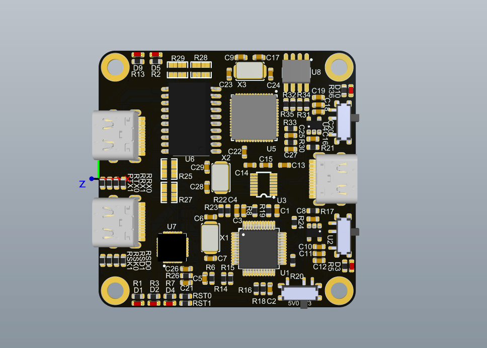

# fzx_link_logic
带link调试功能、串口调试、逻辑分析仪与一身的数字调试器 

## 进度
PCB完成，打样中

## 简介
本项目是一个link logic，用于调试带SWD接口的单片机、以及带有逻辑分析仪。是一个美观、小巧、功能全的逻辑分析仪调试器。

## 优点
- 小巧、多功能
- 插针隐藏设计、方便携带
- 支持DAPlink
- 支持逻辑分析仪
- 支持ESP32等IC的自动下载（RTS、DTR信号预留）
- 使用Typec接口的自定义成SWD、UART信号接口

## 实物展示

## 功能
1. link调试器
2. USB转UART（CP2102虚拟的串口）
3. USB HUB（可以再接入其他1个USB设备，TYPEC接口）
4. TYPEC USB式的SWD、UART接口
5. 信号线交叉硬件设计

## 功能说明
- link功能可使用DAPLink。
- 包含CP2102虚拟一个串口，该串口主要引出RTS、DTR信号，在目标板上合理设计可以自动下载ESP32、STM32串口下载。
- 包含一个USB HUB接口，可接入TYPEC USB设备
